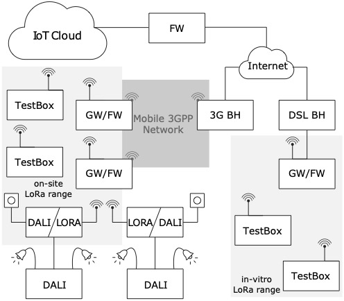
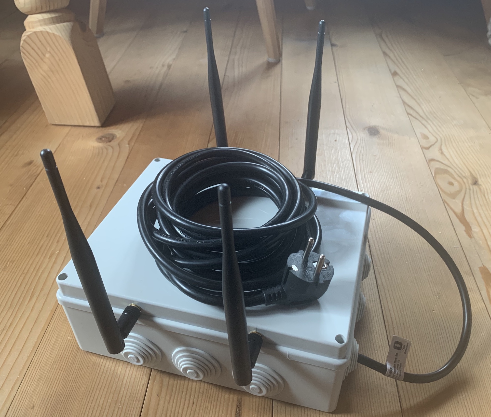
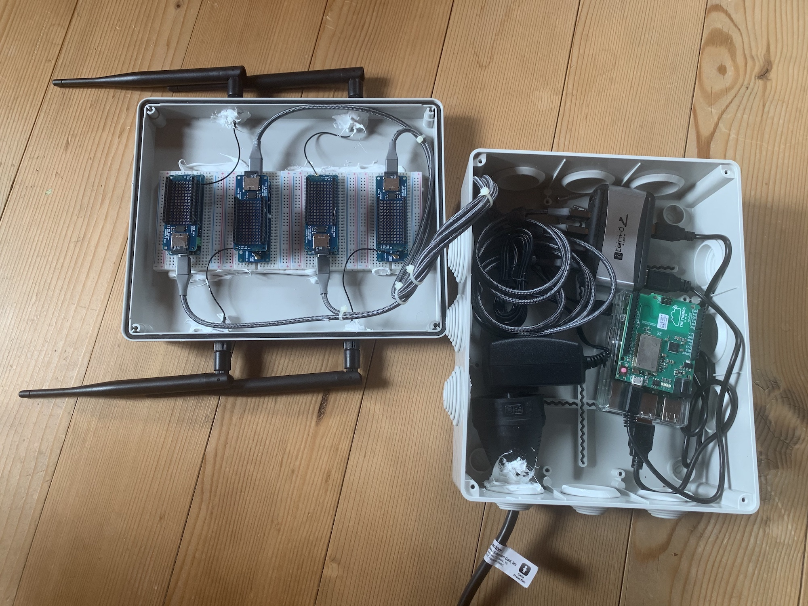
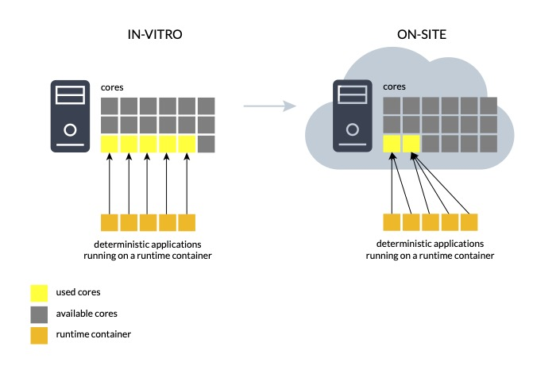
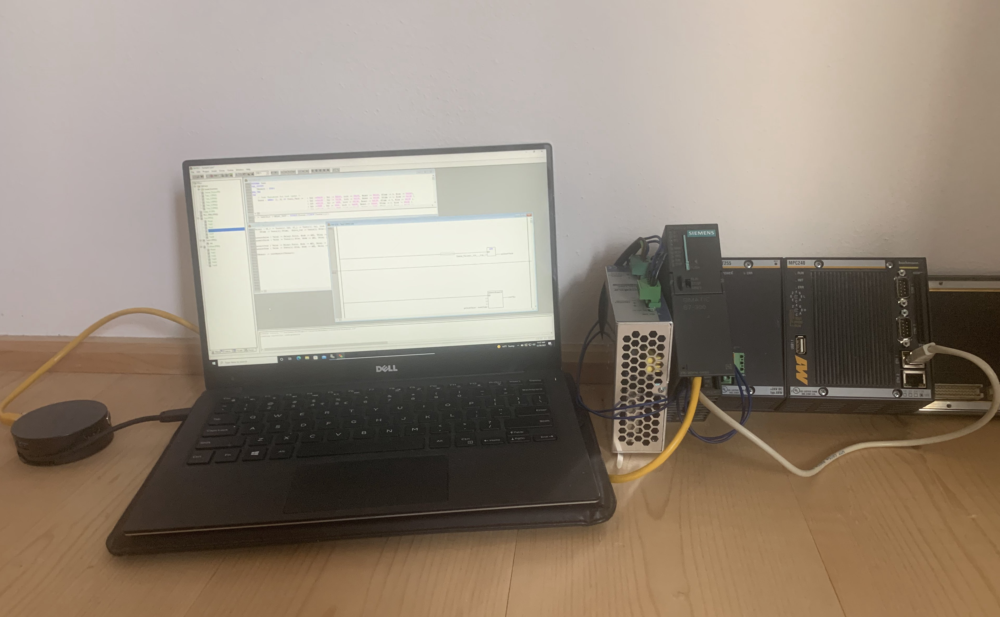

## Welcome to the project website of I4S

The I4S project explores the challenges encountered when retrofitting or interconnecting a previously isolated system to a new Smart-* system-of-systems (SoS). Most of these challenges concern topics of security and resilience, affecting the stability and safety of an SoS. In a recently published book chapter (TSC2022), we process known security analyses and create a layer-based analysis of a Smart-Lighting system, our use case for the project. We elaborate on each element's possible issues and weaknesses and present some first actions to address them. However, it is a theoretical analysis and does thus not determine if these weaknesses are present.

To this aim, we experimentally explore through a common thread of performance their presence and the resilience of such a new system. We divided the project into three modules, connecting to the layers unique to a Smart-* system as follows:
- Communication: A LoRaWan infrastructure test assesses the resilience of a Smart-Lighting communication system
- Virtualization: Through an orchestration tool, we assess and attempt to manage the resilience of containerized real-time control applications
- Legacy testing: A testing framework we developed finally aids in assessing the weaknesses and testing the resilience of a legacy control software

This is just one repository of the I4S family. In the following, we detail components and modules for this project.

## Module Communication

This first module is composed of three repositories. The first [main](https://github.com/flhofer/I4S) repository is the same as this website hosting. It contains scripts and Python code for the automated execution of the tests according to pre-established parameters. The code will be responsible for device management, communication, and parameter download to the connected micro-controllers. The second and third repositories, described in the following, contain the code to be downloaded to the two used microcontrollers to execute the experiments.

For experimentation, we designed two setups as depicted in the following. The setup on the right serves as an in-vitro configuration to tune parameters (of the python script). The left side of the figure shows the on-site configuration. Please see the project documentation for further detail.

The figure's test boxes contain each (end) node and four test nodes with the software below. A raspberry PI 3B+ acts as an execution agent and runs the python script of the principal repository. The two test boxes communicate via an ad-hoc WiFi connection.

The [Project dashboard](https://github.com/users/flhofer/projects/1) contains issues and the next changes to address for this module. This does thus also include the microcontrollers of the two other repositories. 

The following [archive](https://bit.ly/3iIJRh7) contains the logs and results of the tests performed on the Smart-Lighting pilot project in the city of Merano.

### I4S_LoRaWanNode

[This repository](https://github.com/flhofer/I4S_LoRaWanNode) contains the micro-controller code for a _Harward architecture_ micro-controller for end-node testing. This program for the AVR micro-controller is intended to perform regular transmissions in different configurations to test the performance of the network and the communication reliability. It mounts a commercial LoRaWan modem and uses an onboard PCB antenna, perfect for simulating a boxed device.
You can find detail on use and programming in the repository's _README_.

### I4S_LoRaWanTest

Similar to the previous, [this repository](https://github.com/flhofer/I4S_LoRaWanTest) contains the micro-controller code for an ArmV6 based _Von Neumann architecture_ micro-controller for end-node interference testing. The SamD micro-controller also performs different transmissions to test the network's resilience. This model, however, equips a community-maintained LoRaWan modem and library, permitting full access for manipulation and testing purposes.
You can find detail on use and programming in the repository's _README_.

## Module Virtualizzation

This second module experimentally assesses the performance and resilience of real-time control software that migrates to an IaaS solution. We want to measure the behavior of a system that operates initially in a bare-metal system and later in a shared multi-tenant infrastructure while attempting to maintain determinism with changing system configurations. The figure below shows the first (in-vitro) and second (on-site) use cases.

Featured in multiple publications ([Hofer et al. 2019](https://ieeexplore.ieee.org/abstract/document/8968832), [Hofer et al. 2021](https://onlinelibrary.wiley.com/doi/10.1002/sys.21590?af=R), +1 forthcoming), we observe the system's performance in the different phases of migration and orchestration. We assess the suitability of infrastructure solutions and possible limits. We start from a system with dedicated resources for each control software running in a container and introduce system noise and high system load. We measure the instance's execution performance in terms of latency (reactivity) and determinism and implement and extend an orchestration tool to manage the resources for the running control containers.

[The repository](https://github.com/flhofer/real-time-containers) contains source code, test code, compilation tools, and use cases to recreate or extend the tool. Please refer to the _README_ or the _orchestrator.8_ man page for further details.

## Module Legacy testing

In this last experimentation module, we still assess the performance of a system, but this time to improve the testability of a native system. We enable system improvements and contribute to a legacy system's resilience by allowing better testing. Therefore, we want to create and evaluate a testing framework without incurring greater resource and performance loss.

Regarding our Smart-Lighting case study, this use case relates to integrating existing automation. For example, the power supply of the lamp-posts is automated through industrial control systems; specifically, CoDeSys v2.3 programmed Wago 750-8xx systems. Integrating such legacy devices into our Smart-* system for monitoring and control would thus require retrofitting or migration. A test framework would help discover a retrofitted system's newly created or previously undiscovered weaknesses. 

 

The experimentation target is a testing framework for _existing_ IEC 61131-3 Compliant software. We reported the creation and function of the framework in two publications ([HoferRusso2020](https://ieeexplore.ieee.org/abstract/document/8839463), +1 forthcoming). [The module's repository](https://github.com/flhofer/IEC_61131-3_TestLib) contains a framework library, examples, and an automation script.
